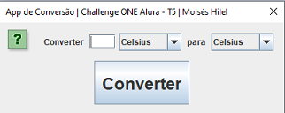

# conversor-moedas-java
Repositório referente ao Challenge proposto por Alura + ONE (Oracle Next Education)

## Sobre o desafio:

Neste desafio foi designado que fosse desenvolvido um conversor de moedas, com valores prefixados e um segundo conversor à escolha do aluno.

### Requisitos do Convesor de Moedas:

O conversor de moedas deveria aceitar as seguintes conversões:

    * Reais a Dólar
    
    * Reais a Euro
    
    * Reais a Libras Esterlinas
    
    * Reais a Peso argentino
    
    * Reais a Peso Chileno
    

Obs.: Também era necessário aceitar toda conversão inversa.

#### Sobre o desenvolvimento do projeto:

  Foi desenvolvido de forma que seja bem intuitiva para o usuario,
  Usando campos de faceis acesso para selecionar a conversão desejada.

  No total contém 3 conversores, sendo eles:
    *Conversor de moedas (Com cotação atual via api)
    *Conversor de temperatura
    *Conversor de Medidas (Comprimento)

Não foi usado valores prefixados na conversão de moedas , para tornar a experiencia do usuario ainda mais util.

#### Funções Desenvolvidas:

___________________________________

       ### Moedas disponiveis para conversão:
      
       * BRL - Real Brasileiro
       * USD - Dólar Americano
       * EUR - Euro
       * GBP - Libra Esterlina
       * ARS - Peso Argentino
       * CLP - Peso Chileno
       * JPY - Iene Japonês
       * CNY - Yuan Chinês

___________________________________

        ### Temperaturas disponiveis para conversão:

        * Celsius
        * Fahrenheit
        * Kelvin
___________________________________

        ### Medidas de comprimento disponiveis para conversão:

        * Metros
        * Decímetros
        * Centímetros
        * Milímetros

___________________________________
